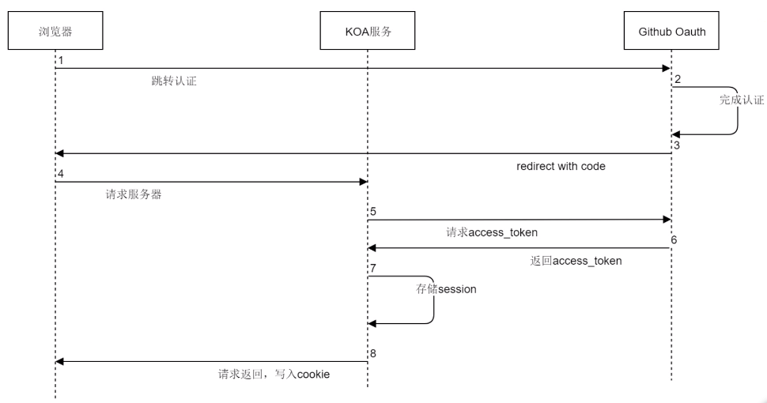

<!--
 * @Description: In User Settings Edit
 * @Author: your name
 * @Date: 2019-09-29 17:33:54
 * @LastEditTime: 2019-10-16 14:15:20
 * @LastEditors: jimmiezhou
 -->

## 认证和授权

- 认证
  - 用户名密码代表一个用户
  - 身份证代表一个人
  - 手机号也可以确定一个人
- 互联网中的认证
  - 用户名密码登录
  - 邮箱发送登录连接
  - 手机号接收验证码
- 需要考虑的问题

  - 让用户设置高强度的密码
  - 对密码存储进行加密
  - 保证客户端和服务端安全通行，防止密码被窃取(https)
  - 将密码存在安全的数据库中
  - 提供恢复密码功能

- 授权

  - 安装手机应用的时候会询问权限
  - 你在登陆系统后，会有权限授予
  - 在 OAth 后，被授权方会收获一定的权限

## 什么是 OAuth

- 网页登陆后，cookie 就是授权的凭证，
- OAuth 是一种行业标准的授权方式
- OAuth 通过 token 授予权限

- 角色
  - 客户端（浏览器）
  - 服务端（node 服务）
  - 授权服务器（github）

## OAuth 授权流程

## cookie
>cookie就是cookie，保存session是它其中的一部分功能